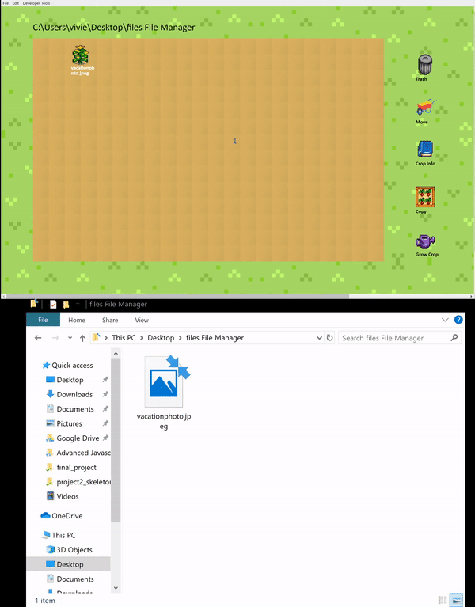

## Introduction
### Farm Theme File Manager

This program is a file manager with a unique GUI that allows users to delete, create, move, and view information of files. The theme of this program is farming. The files and folders are represented by the following:  

- Files: crops (fruits / vegetables)  
- Folders: cows (because when you double click on them, old crops disappear and new ones appear (simulating cows eating crops and their manure helping to create new ones) 
- Current Path: displayed on top 

### Functionality Overview 
 
The following functionalities are represented by the buttons below: 
- Trash (multiple): deleting files / folders  

- Move (single): moving files  
- Crop Info (single): viewing file information  
- Copy (single): copying files from current directory to any other one 
- Grow Crop (single):  create file / folder  

Other functionalities: 

- Going into a directory (double clicking) 
    - Re-renders the page and shows all files / folders in the double clicked directory 
- Back Button (located on bottom left): go back up a directory 
 
### Functionalities in Detail
 
**Delete files / folders**

You can select multiple files and directories. 
- Every time a file or folder is selected, it gets pushed onto a global array (by group name) 
    - Indicated by lower opacity of the image and text turns green 
- Once you decide these are the files / folders you want to delete, you click on the trash button. The on click function loops through the global array to locate these groups and delete from the interface. It determines if they are a file or folder and deletes them accordingly. 
- Page re-renders.

**Create files / folders**

Click on the ‘Grow Crop’ button 
- A separate prompt window should pop up and prompt for file or folder name. If there is a ‘.’ submitted text, the program sees this as a file creation. If there is not, it is a folder creation.  
- Cows are made for folders and crops are for files. Page re-renders. 

**Copy files**  

Select one file to copy and then select the ‘Copy’ button  
- Even though you can select multiple files, the last file that gets clicked is chosen to get copied.  
- A prompt should pop up asking for a full path of a different directory you want to copy to. 
 
**Move files**

Same as copying files, except the file you selected is deleted from the current directory. 
 
**Viewing file information** 

Select a file and then click ‘Crop Info’ 
- File information is displayed on the right side of the program.
- Gets re-rendered every time you select a new file and ‘Crop Info’ 

## Installation

`npm install`

## Run Program

`npm start`
